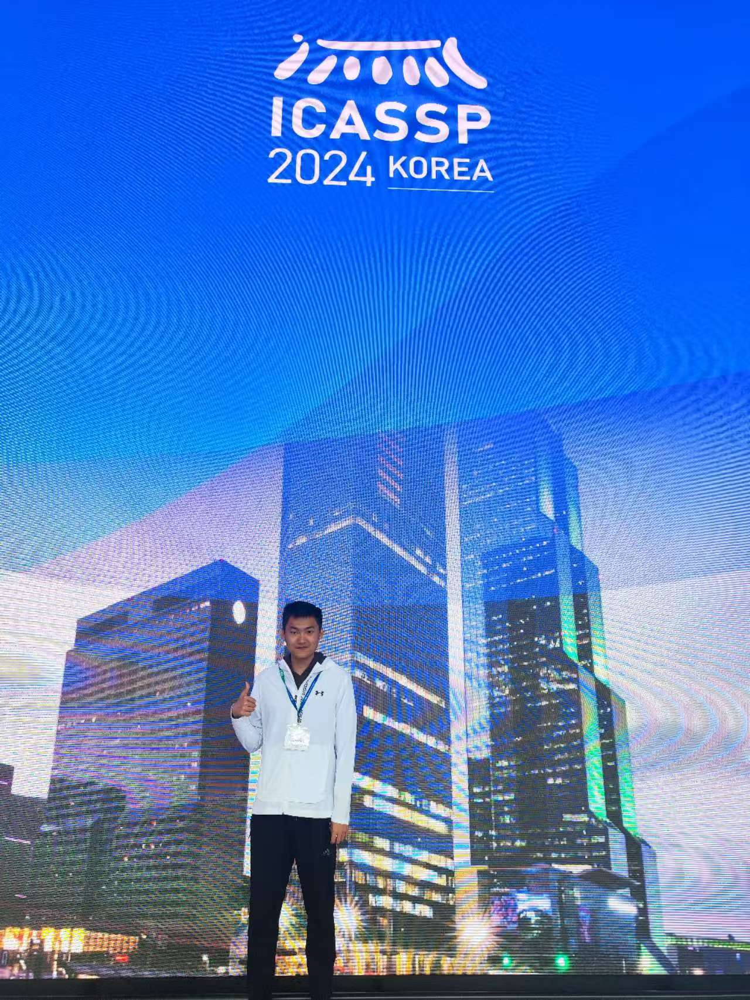

I presented our paper, [An initial investigation of neural replay simulator for over-the-air adversarial perturbations to automatic speaker verification](https://arxiv.org/abs/2310.05354) in ICASSP 2024 in Korea!

